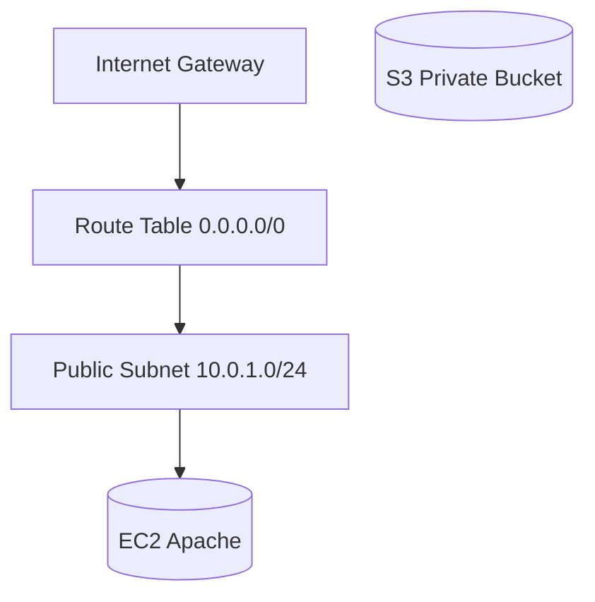

# 🚀 Projeto AWS CloudFormation – Infraestrutura Automatizada

Este repositório faz parte do desafio **“Entendendo o Desafio”** da [DIO](https://www.dio.me/), com objetivo de praticar **Infraestrutura como Código (IaC)** na AWS e documentar de forma clara o aprendizado.

---

## 📌 Objetivos do Projeto

- Aplicar os conceitos aprendidos em **CloudFormation** em um ambiente prático.  
- **Documentar** o processo técnico de forma clara e estruturada.  
- Utilizar o **GitHub como portfólio técnico**, compartilhando prints, anotações e insights.  

---

## 📂 Estrutura do Repositório

```
/ (raiz do repo)
 ├── README.md
 ├── /templates      → arquivos .yaml ou .json usados no CloudFormation
 ├── /images         → capturas de tela organizadas
```

---

## ⚙️ Pré-requisitos

- Conta AWS Free Tier configurada.  
- Conhecimentos básicos de:
  - CloudFormation
  - Console AWS
  - Git e GitHub  

---

## 🏗️ Arquitetura Criada



---

## 📜 Parâmetros do Template

| Nome       | Tipo      | Descrição                                   | Exemplo           |
|------------|----------|-----------------------------------------------|-------------------|
| VpcCIDR    | String   | Bloco CIDR para a VPC                        | 10.0.0.0/16       |
| SubnetCIDR | String   | Bloco CIDR para a Subnet pública             | 10.0.1.0/24       |
| KeyName    | String   | Nome do par de chaves SSH                    | my-key            |

---

## 📤 Outputs do Template

| Nome           | Descrição                               | Exemplo/Valor Gerado         |
|----------------|-----------------------------------------|-------------------------------|
| VpcId          | ID da VPC criada                        | vpc-0a1b2c3d4e5f67890        |
| SubnetId       | ID da Subnet criada                     | subnet-0123abcd4567efgh8     |
| EC2PublicIP    | IP público da instância EC2             | 54.123.45.67                 |
| S3BucketName   | Nome do bucket S3 criado                | my-bucket-lab123             |

---

## 🖼️ Prints das Etapas

- Stack criada com sucesso  
  

- Recursos criados (VPC, Subnet, S3, EC2)  
  

- Teste de acesso (se aplicável)  
  

- Exclusão da stack  
  

---

## 🔍 Insights e Aprendizados

- **CloudFormation é declarativo**: você descreve e a AWS cria/exclui automaticamente.  
- Buckets S3 têm nomes **globais** (não podem se repetir entre contas/regiões).  
- Ordem de exclusão importa → **primeiro a stack, depois recursos dependentes**.  
- Documentar com prints ajuda a fixar os conceitos.  

---

## 💻 Subindo via CLI (Opcional)

```bash
aws cloudformation deploy   --template-file templates/main.yaml   --stack-name cloudformation-lab   --capabilities CAPABILITY_IAM
```

---

## ✅ Checklist de Entrega

- [x] Repositório público no GitHub  
- [x] README.md detalhado  
- [x] Prints organizados em `/images`  
- [x] Template salvo em `/templates`  
- [x] Insights registrados  

---

## 📎 Referências

- [AWS CloudFormation Docs](https://docs.aws.amazon.com/cloudformation/)  
- [Guia Markdown GitHub](https://docs.github.com/pt/get-started/writing-on-github)  

---
